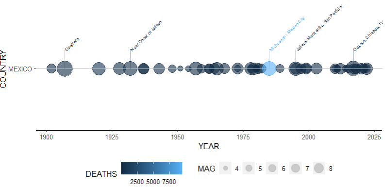
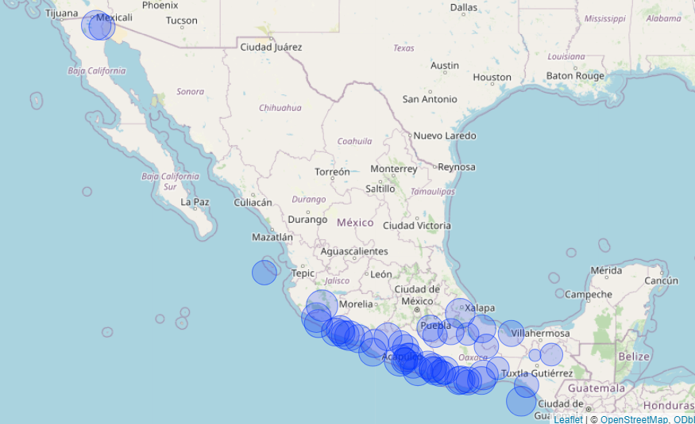

```{r setup, include=FALSE}
knitr::opts_chunk$set(echo = TRUE)
library(dplyr)
library(ggplot2)
library(devtools)
```

# Earthquakes Package

<!-- badges: start -->
[](https://github.com/hriisalu/earthquakes/actions/workflows/R-CMD-check.yaml)
<!-- badges: end -->

## Note about the badge

The package uses the R-CMD-check badge from GitHub instead of Travis because Travis does not offer a free version.

## Overview

The `earthquakes` package provides tools for visualizing significant earthquake data from around the world. The dataset is obtained from the U.S. National Oceanographic and Atmospheric Administration (NOAA) and contains information about 5,933 earthquakes over approximately 4,000 years.

## Installation

You can install the development version of the package from GitHub using `devtools`:

```{r install, eval=FALSE}
# Install devtools if you haven't already
# install.packages("devtools")
library(devtools)
# Install the earthquakes package
devtools::install_github("hriisalu/earthquakes", build_vignettes = TRUE, force = TRUE)
```

## Loading the Data
The dataset is included in the package and can be loaded as follows:

```{r read, message = FALSE, warning = FALSE}
raw_data <- read.delim(system.file("extdata", "earthquakes.tsv", package = "earthquakes"), header = TRUE, sep = "\t")
```

## Data Cleaning

This function `eq_clean_data` cleans the NOAA earthquake dataset by creating a date column, converting latitude and longitude to numeric, extracting country names, and cleaning location names. The function includes a helper function `extract_country` to extract the country name from the location name column. Another helper function, `eq_location_clean`, cleans the location name column by removing the country name and converting the location to title case.

```{r clean}
library(earthquakes)
cleaned_data <- eq_clean_data(raw_data)
```

Here is the structure of the cleaned dataset:
```{r clean_structure, echo=FALSE}
str(cleaned_data)
```

## Visualization of the Timeline

In conjunction with the `ggplot2` package, the `earthquakes` package helps visualize the times at which earthquakes occur within certain countries. In addition to showing the dates of the earthquakes, we can also display their magnitudes (Richter scale value) and the number of deaths associated with each earthquake.

First, filter the data for a specific country (or countries) and a specific time period:

```{r filter}
filtered_data <- cleaned_data %>%
  filter(YEAR > 1900, !is.na(DEATHS), !is.na(MAG), !is.na(DATE), COUNTRY == "MEXICO")
```

Using `ggplot` and adding the `geom_timeline` function creates a timeline of significant earthquakes. The size of the points represents the magnitude of the earthquakes. The `x` aesthetic represents the date (column `DATE`), the `y` aesthetic is a factor indicating the country (column `COUNTRY`), the `size` aesthetic represents the magnitude (column `MAG`), and the `colour` aesthetic represents the number of deaths (column `DEATHS`).

You can also add annotations to the earthquake data using the `geom_timeline_label` function. It adds a vertical line to each data point with the text of the earthquake location attached to each line. You can set the maximum number of earthquakes to show by setting the `n_max` in `geom_timeline_label`. The `label` aesthetic takes the column name from which annotations will be obtained.

```{r timeline, echo=TRUE, eval=FALSE}
ggplot(filtered_data, aes(x = DATE, y = COUNTRY, size = MAG, colour = DEATHS, label = LOCATION_NAME)) +
  geom_timeline() +
  geom_timeline_label(n_max = 5) +
  theme_timeline()
```

{width=400px}


## Visualization the earthquakes on the map

In addition to visualizing earthquakes over time, the `earthquakes` package provides tools for visualizing them on a map. Each earthquake is shown with a circle, where the radius is proportional to the earthquake's magnitude (column `MAG`). 

The function `eq_map` maps the epicenters (LATITUDE/LONGITUDE) and annotates each point with a popup window containing annotation data stored in a column of the dataframe.


### Create Labels
The `eq_create_label` function creates HTML labels for each earthquake event, which will open as popup boxes when hovering over the map.

```{r create_labels, echo = TRUE, message = FALSE, warning = FALSE}
# Create labels for the cleaned data
filtered_data$popup_text <- eq_create_label(filtered_data)
```

### Plot the Map
The `eq_map function` plots the earthquake events on an interactive map. The function arguments are the dataset, where you have filtered for a specific country and time period, and the column containing the annotation text for the popup window.

```{r map, echo=TRUE, eval=FALSE, message=FALSE, warning=FALSE}
eq_map(filtered_data, "popup_text")
```

Here is an image of the map. When working with the htmlwidget, the map will be interactive.

{width=400px}

For more detailed usage examples, please refer to the package vignettes or the function documentation.

## References
NOAA National Centers for Environmental Information (NCEI). [Significant Earthquake Database](https://www.ngdc.noaa.gov/hazel/view/hazards/earthquake/search).

## License
This package is licensed under the GPL License.


