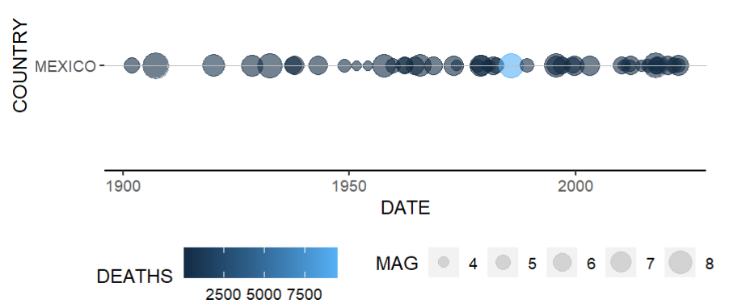
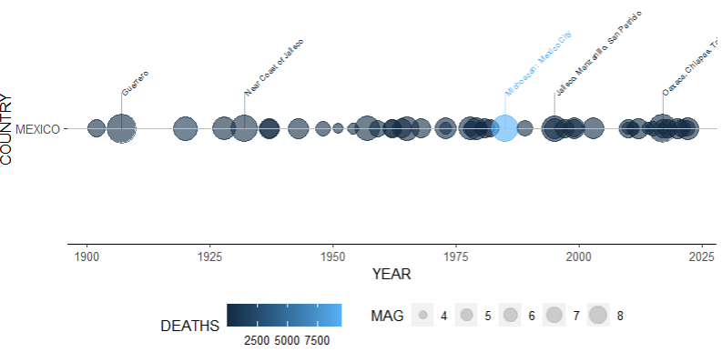
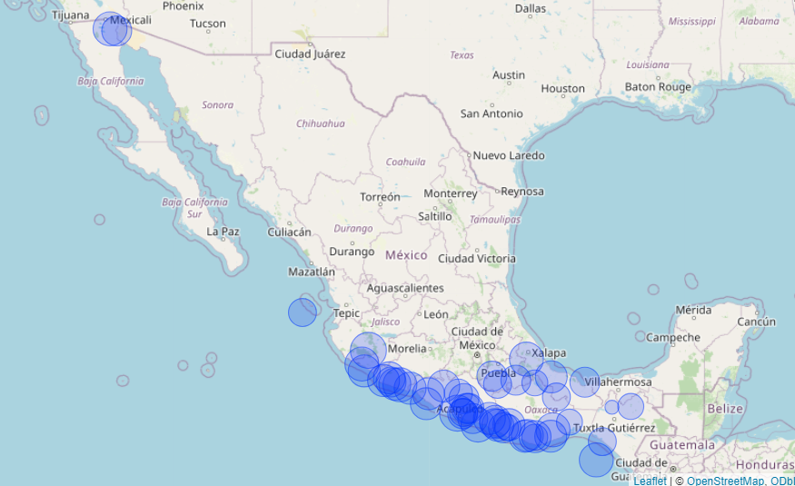

```{r, include = FALSE}
knitr::opts_chunk$set(
  collapse = TRUE,
  comment = "#>"
)
```

```{r setup, include=FALSE, echo = FALSE, message = FALSE, warning = FALSE}
library(dplyr)
library(ggplot2)
library(devtools)
library(earthquakes)
```

## Introduction

The `earthquakes` package provides tools for visualizing significant earthquake data from around the world. The dataset is obtained from the U.S. National Oceanographic and Atmospheric Administration (NOAA) and contains information about 5,933 earthquakes over approximately 4,000 years. 

In conjunction with the `ggplot2` package, the `earthquakes` package helps visualize the times at which earthquakes occur within certain countries. In addition to visualizing earthquakes over time, the `earthquakes` package provides tools for mapping earthquake data. 

## Loading the Data

The dataset is included in the package and can be loaded as follows:

```{r read, message = FALSE, warning = FALSE}
raw_data <- read.delim(system.file("extdata", "earthquakes.tsv", package = "earthquakes"), header = TRUE, sep = "\t")
```


### Function `extract_country`

This helper function extracts the country name from the location name column. If the location name contains a colon, it extracts the part before the colon. If there is no colon, it returns the entire location name. If the input is NA or non-character, it returns NA.

```{r extract_country}
library(earthquakes)
# Example
location_name <- c("MEXICO: Acapulco")
extract_country(location_name)
```
### Function `eq_location_clean`

This function cleans the location name column by removing the country name and converting the location to title case. If the location name contains a colon, it extracts the part after the colon. If there is no colon, it returns the entire location name. If the input is NA or non-character, it returns NA.

```{r location_clean}
# Example
locations <- c("Mexico: Acapulco", "Japan: Tokyo", "Chile: Santiago")
eq_location_clean(locations)
```

### Function `eq_clean_data`

This function cleans the NOAA earthquake dataset by creating a date column, converting latitude and longitude to numeric, extracting country names, cleaning location names, and converting the column names to upper case. The function includes the previously described helper functions `extract_country` and `eq_location_clean`.


```{r clean_data}
# Example
cleaned_data <- eq_clean_data(raw_data)
```

Here is the structure of the cleaned dataset:

```{r clean_structure, echo=FALSE}
str(cleaned_data)
```

To visualize the times at which earthquakes occur within certain countries, the user should filter the data for a specific country (or countries) and a specific time period.

```{r filter}
# Example
filtered_data <- cleaned_data %>%
  filter(YEAR > 1900, !is.na(DEATHS), !is.na(MAG), !is.na(DATE), COUNTRY == "MEXICO")
```

## Function `geom_timeline`

Using `ggplot` and adding the `geom_timeline` function creates a timeline of significant earthquakes. The size of the points represents the magnitude of the earthquakes. The `x` aesthetic represents the date (column `DATE`), the `y` aesthetic is a factor indicating the country (column `COUNTRY`), the `size` aesthetic represents the magnitude (column `MAG`), and the `colour` aesthetic represents the number of deaths (column `DEATHS`).

```{r timeline, echo=TRUE, eval=FALSE}
ggplot(filtered_data, aes(x = DATE, y = COUNTRY, size = MAG, colour = DEATHS, label = LOCATION_NAME)) +
  geom_timeline() +
  theme_timeline()
```
{width=400px}

## Function `geom_timeline_label`

The user can also add annotations to the earthquake data using the `geom_timeline_label` function. It adds a vertical line to each data point with the text of the earthquake location attached to each line. You can set the maximum number of earthquakes to show by setting the `n_max` parameter in `geom_timeline_label`. The `label` aesthetic takes the column name from which annotations will be obtained.

```{r timeline_label, echo=TRUE, eval=FALSE}
ggplot(filtered_data, aes(x = DATE, y = COUNTRY, size = MAG, colour = DEATHS, label = LOCATION_NAME)) +
  geom_timeline() +
  geom_timeline_label(n_max = 5) +
  theme_timeline()
```

{width=400px}


### Function `eq_create_label`
The function creates labels for pop-up annotations in a Leaflet map, providing details about earthquake locations (column ´LOCATION_NAME`), magnitudes (column `MAG`), and total deaths (column `TOTAL_DEATHS`). The annotation is used in popup boxes when hovering over the map. 

```{r create_labels, echo = TRUE, message = FALSE, warning = FALSE}
# Example
filtered_data$popup_text <- eq_create_label(filtered_data)
```


### Function `eq_map`

The function maps the epicenters (columns `LATITUDE` and `LONGITUDE`). Each earthquake is shown with a circle, where the radius is proportional to the earthquake's magnitude (column `MAG`). The function arguments are the dataset, where you have filtered for a specific country and time period, and the column containing the annotation text for the popup window.

```{r map, echo=TRUE, eval=FALSE, message=FALSE, warning=FALSE}
eq_map(filtered_data, "popup_text")
```

Here is an image of the map. When working with the htmlwidget, the map will be interactive.

{width=400px}

This vignette provides an overview of the functionalities offered by the `earthquakes` package. For more detailed information on each function, refer to the function documentation.

## References
NOAA National Centers for Environmental Information (NCEI). [Significant Earthquake Database](https://www.ngdc.noaa.gov/hazel/view/hazards/earthquake/search).
